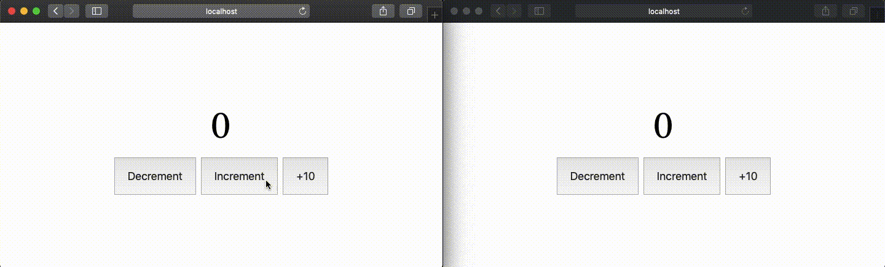

# storeon-cross-tab


     
The 165 bytes module for [Storeon](https://github.com/storeon/storeon) to sync state at different tabs of the browser. It syncs state on every change. It uses [Size Limit](https://github.com/ai/size-limit) to control the size.

## Installation

```
npm install isolovev/cross-tab
# or 
yarn add isolovev/cross-tab
```

## Usage

If you want sync state between tabs of the browser you should import the `crossTab` from `isolovev/cross-tab` and add this module to `createStore`.

```js
import createStore from 'storeon'
import crossTab from 'cross-tab'

let increment = store => {
  store.on('@init', () => ({ count: 0 }))
  store.on('inc', ({ count }) => ({ count: count + 1 }))
}

export const store = createStore([increment, crossTab()])
```

```js
import useStoreon from 'storeon/react' // or storeon/preact

export default const Counter = () => {
  const { dispatch, count } = useStoreon('count')
  return <button onClick={() => dispatch('inc')}>{count}</button>
}
```

```js
import StoreContext from 'storeon/react/context'

render(
  <StoreContext.Provider value={store}>
    <Counter />
  </StoreContext.Provider>,
  document.querySelector('#app')
)
```

<p>
  <a href="https://evrone.com/?utm_source=storeon-cross-tab">
    
  </a>
</p>


## Example



### crossTab(config)

```js
typeof config.key === 'string'
```

Default value of `config.key` is `storeon-crosstab`. This key is using to sync data in local storage.

```js
typeof config.resetInit === 'boolean'
```

Default value of `config.resetInit` is `false`. This key is used to reset the state at page by overload.

## Sponsor


## LICENSE

MIT
